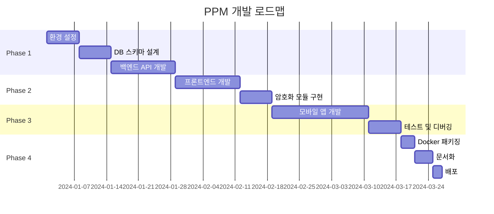

# 개인 비밀번호 관리 시스템 요구사항정의서

## 1. 프로젝트 개요

### 1.1 프로젝트명
Personal Password Manager (PPM)

### 1.2 목적
- 개인용 비밀번호를 안전하게 저장하고 관리하는 웹/앱 기반 시스템 구축
- 자체 호스팅 가능한 오픈소스 솔루션 개발
- 직관적인 UI/UX로 편리한 비밀번호 관리 환경 제공

### 1.3 목표 사용자
- 개인 사용자 (1차 목표)
- 소규모 팀/가족 단위 사용자 (2차 목표)

## 2. 기능 요구사항

### 2.1 사용자 인증
| 기능 ID | 기능명 | 설명 | 우선순위 |
|---------|---------|------|----------|
| AUTH-001 | 마스터 비밀번호 로그인 | 마스터 비밀번호로 시스템 접근 | 필수 |
| AUTH-002 | 생체인증 | 지문/얼굴 인식 지원 (모바일) | 선택 |
| AUTH-003 | 2FA 인증 | TOTP 기반 2차 인증 | 권장 |
| AUTH-004 | 세션 관리 | 자동 로그아웃 (유휴 시간 설정) | 필수 |

### 2.2 비밀번호 관리
| 기능 ID | 기능명 | 설명 | 우선순위 |
|---------|---------|------|----------|
| PWD-001 | 비밀번호 등록 | URL, ID, 비밀번호, 메모 저장 | 필수 |
| PWD-002 | 비밀번호 조회 | 검색 및 필터링 기능 | 필수 |
| PWD-003 | 비밀번호 수정/삭제 | 기존 정보 업데이트 | 필수 |
| PWD-004 | 비밀번호 생성기 | 강력한 비밀번호 자동 생성 | 필수 |
| PWD-005 | 비밀번호 강도 체크 | 실시간 강도 분석 | 권장 |
| PWD-006 | 중복 비밀번호 검사 | 동일 비밀번호 사용 경고 | 권장 |

### 2.3 데이터 관리
| 기능 ID | 기능명 | 설명 | 우선순위 |
|---------|---------|------|----------|
| DATA-001 | 가져오기 | CSV/JSON 파일 임포트 | 필수 |
| DATA-002 | 내보내기 | 암호화된 백업 파일 생성 | 필수 |
| DATA-003 | 자동 백업 | 주기적 백업 스케줄링 | 권장 |
| DATA-004 | 동기화 | 멀티 디바이스 실시간 동기화 | 선택 |

### 2.4 검색 및 분류
| 기능 ID | 기능명 | 설명 | 우선순위 |
|---------|---------|------|----------|
| SRCH-001 | 키워드 검색 | 사이트명, URL, 메모 검색 | 필수 |
| SRCH-002 | 퍼지 검색 | 유사 단어 검색 지원 | 권장 |
| SRCH-003 | 카테고리 분류 | 금융, SNS, 쇼핑 등 분류 | 필수 |
| SRCH-004 | 태그 기능 | 사용자 정의 태그 | 권장 |
| SRCH-005 | 즐겨찾기 | 자주 사용하는 항목 관리 | 필수 |

## 3. 비기능 요구사항

### 3.1 보안 요구사항
- 모든 비밀번호는 AES-256 암호화 적용
- HTTPS 통신 필수
- SQL Injection, XSS 등 보안 취약점 대응
- 클립보드 자동 삭제 기능 (30초)

### 3.2 성능 요구사항
- 검색 응답시간: 1초 이내
- 동시 사용자: 10명 이상 (가족/팀 공유 시)
- 데이터베이스 용량: 10,000개 이상 항목 저장

### 3.3 사용성 요구사항
- 반응형 웹 디자인 (모바일/태블릿/PC)
- 다크모드 지원
- 다국어 지원 (한국어/영어)

## 4. 시스템 아키텍처

### 4.1 기술 스택
```yaml
Frontend:
  - Framework: React 18
  - UI Library: Material-UI / Tailwind CSS
  - State Management: Redux Toolkit
  - Language: TypeScript

Backend:
  - Framework: Node.js + Express
  - Database: MySQL 8.0 (Docker)
  - ORM: Sequelize / TypeORM
  - Cache: Redis (선택)
  - Language: TypeScript

Mobile:
  - Framework: Flutter (Cross-platform)
  - Local Storage: SQLite + 암호화

Infrastructure:
  - Container: Docker + Docker Compose
  - Reverse Proxy: Nginx
  - SSL: Let's Encrypt
```

### 4.2 시스템 구성도
```
┌─────────────┐     ┌─────────────┐     ┌─────────────┐
│   Web App   │     │ Mobile App  │     │   API Client│
└──────┬──────┘     └──────┬──────┘     └──────┬──────┘
       │                   │                    │
       └───────────────────┴────────────────────┘
                           │
                    ┌──────▼──────┐
                    │   Nginx     │
                    │   (HTTPS)   │
                    └──────┬──────┘
                           │
                    ┌──────▼──────┐
                    │  API Server │
                    │  (Node.js)  │
                    └──────┬──────┘
                           │
                ┌──────────┴──────────┐
                │                     │
         ┌──────▼──────┐      ┌──────▼──────┐
         │    MySQL    │      │    Redis    │
         │   (Main)    │      │   (Cache)   │
         └─────────────┘      └─────────────┘
 
 ※  Redis는 2차 개발
```

## 5. 메뉴 구성

### 5.1 메인 메뉴 구조
```
PPM (Personal Password Manager)
├── 🏠 대시보드
│   ├── 최근 사용 항목
│   ├── 즐겨찾기
│   └── 보안 상태 요약
├── 🔑 비밀번호
│   ├── 전체 목록
│   ├── 카테고리별 보기
│   ├── 새 비밀번호 추가
│   └── 비밀번호 생성기
├── 🔍 검색
│   ├── 빠른 검색
│   └── 고급 검색
├── ⚙️ 설정
│   ├── 보안 설정
│   ├── 백업/복원
│   ├── 가져오기/내보내기
│   └── 일반 설정
└── 👤 프로필
    ├── 마스터 비밀번호 변경
    ├── 2FA 설정
    └── 로그아웃
```

### 5.2 화면별 상세 기능

#### 5.2.1 대시보드
- 최근 7일간 사용한 비밀번호 목록 (최대 10개)
- 즐겨찾기 항목 퀵 액세스
- 보안 점수 표시 (약한 비밀번호 개수, 중복 사용 등)
- 만료 예정 비밀번호 알림

#### 5.2.2 비밀번호 관리
```javascript
// 비밀번호 항목 데이터 구조
interface PasswordItem {
  id: string;
  title: string;
  url: string;
  username: string;
  password: string; // 암호화된 상태
  category: string;
  tags: string[];
  notes: string;
  createdAt: Date;
  updatedAt: Date;
  lastUsed: Date;
  expiryDate?: Date;
  isFavorite: boolean;
}
```

## 6. 암호화 관리

### 6.1 암호화 정책
```python
# 암호화 구현 예시
from cryptography.hazmat.primitives.kdf.pbkdf2 import PBKDF2HMAC
from cryptography.hazmat.primitives import hashes
from cryptography.fernet import Fernet
import base64
import os

class EncryptionManager:
    def __init__(self, master_password: str):
        # 마스터 비밀번호로부터 암호화 키 생성
        kdf = PBKDF2HMAC(
            algorithm=hashes.SHA256(),
            length=32,
            salt=self._get_salt(),
            iterations=100000,
        )
        key = base64.urlsafe_b64encode(kdf.derive(master_password.encode()))
        self.cipher_suite = Fernet(key)
    
    def encrypt(self, plaintext: str) -> str:
        return self.cipher_suite.encrypt(plaintext.encode()).decode()
    
    def decrypt(self, ciphertext: str) -> str:
        return self.cipher_suite.decrypt(ciphertext.encode()).decode()
    
    def _get_salt(self) -> bytes:
        # 환경변수 또는 설정 파일에서 고정 Salt 읽기
        return os.environ.get('ENCRYPTION_SALT', b'default-salt').encode()
```

### 6.2 키 관리
- 마스터 키는 환경변수로 관리
- 데이터베이스 연결 정보 별도 암호화
- SSL 인증서 자동 갱신 (certbot)

### 6.3 MySQL 암호화 함수 활용
```sql
-- MySQL 내장 암호화 함수 사용 예시
-- AES 암호화
INSERT INTO passwords (title, username, password) 
VALUES ('example', 'user@email.com', AES_ENCRYPT('password123', @encryption_key));

-- AES 복호화
SELECT title, username, AES_DECRYPT(password, @encryption_key) as password 
FROM passwords WHERE id = 1;
```

## 7. 백업 및 복구

### 7.1 자동 백업
```bash
#!/bin/bash
# backup.sh - 일일 백업 스크립트

DATE=$(date +%Y%m%d_%H%M%S)
BACKUP_DIR="/backup/ppm"
DB_NAME="ppm_db"
DB_USER="ppm_user"
DB_PASS="${DB_PASSWORD}"

# MySQL 백업
docker exec ppm-mysql mysqldump -u $DB_USER -p$DB_PASS $DB_NAME > $BACKUP_DIR/db_backup_$DATE.sql

# 백업 파일 압축 및 암호화
tar -czf - $BACKUP_DIR/db_backup_$DATE.sql | gpg --encrypt --recipient backup@ppm.local > $BACKUP_DIR/db_backup_$DATE.tar.gz.gpg

# 원본 SQL 파일 삭제
rm $BACKUP_DIR/db_backup_$DATE.sql

# 7일 이상 된 백업 삭제
find $BACKUP_DIR -name "*.tar.gz.gpg" -mtime +7 -delete

# 원격 저장소 동기화 (선택)
# rclone sync $BACKUP_DIR remote:ppm-backups
```

### 7.2 백업 정책
| 백업 유형 | 주기 | 보관 기간 | 저장 위치 |
|-----------|------|-----------|-----------|
| 전체 백업 | 일일 | 7일 | 로컬 서버 |
| 증분 백업 | 시간별 | 24시간 | 로컬 서버 |
| 외부 백업 | 주간 | 4주 | 클라우드/NAS |

### 7.3 복구 절차
1. 백업 파일 선택 및 복호화
2. MySQL 데이터베이스 복원
   ```bash
   # 백업 파일 복호화 및 압축 해제
   gpg --decrypt backup_file.tar.gz.gpg | tar -xzf -
   
   # MySQL 복원
   docker exec -i ppm-mysql mysql -u root -p$MYSQL_ROOT_PASSWORD ppm_db < db_backup.sql
   ```
3. 설정 파일 복원
4. 시스템 무결성 검증
5. 서비스 재시작

## 8. 실행 방안

### 8.1 개발 단계


### 8.2 Docker Compose 설정
```yaml
version: '3.8'

services:
  nginx:
    image: nginx:alpine
    ports:
      - "80:80"
      - "443:443"
    volumes:
      - ./nginx.conf:/etc/nginx/nginx.conf
      - ./ssl:/etc/nginx/ssl
    depends_on:
      - backend

  backend:
    build: ./backend
    environment:
      - NODE_ENV=production
      - DB_HOST=mysql
      - DB_USER=ppm_user
      - DB_PASSWORD=${DB_PASSWORD}
      - REDIS_HOST=redis
      - ENCRYPTION_KEY=${ENCRYPTION_KEY}
    depends_on:
      - mysql
      - redis

  frontend:
    build: ./frontend
    ports:
      - "3000:80"

  mysql:
    image: mysql:8.0
    command: --default-authentication-plugin=mysql_native_password
    environment:
      - MYSQL_ROOT_PASSWORD=${MYSQL_ROOT_PASSWORD}
      - MYSQL_DATABASE=ppm_db
      - MYSQL_USER=ppm_user
      - MYSQL_PASSWORD=${DB_PASSWORD}
    volumes:
      - mysql_data:/var/lib/mysql
      - ./backup:/backup
      - ./init.sql:/docker-entrypoint-initdb.d/init.sql

  redis:
    image: redis:7-alpine
    command: redis-server --requirepass ${REDIS_PASSWORD}

  phpmyadmin:
    image: phpmyadmin/phpmyadmin
    environment:
      - PMA_HOST=mysql
      - PMA_PORT=3306
    ports:
      - "8080:80"
    depends_on:
      - mysql

volumes:
  mysql_data:
```

### 8.3 MySQL 초기 스키마
```sql
-- init.sql
CREATE DATABASE IF NOT EXISTS ppm_db CHARACTER SET utf8mb4 COLLATE utf8mb4_unicode_ci;
USE ppm_db;

-- 사용자 테이블
CREATE TABLE users (
    id INT AUTO_INCREMENT PRIMARY KEY,
    username VARCHAR(255) UNIQUE NOT NULL,
    master_password_hash VARCHAR(255) NOT NULL,
    salt VARCHAR(255) NOT NULL,
    totp_secret VARCHAR(255),
    created_at TIMESTAMP DEFAULT CURRENT_TIMESTAMP,
    updated_at TIMESTAMP DEFAULT CURRENT_TIMESTAMP ON UPDATE CURRENT_TIMESTAMP
);

-- 카테고리 테이블
CREATE TABLE categories (
    id INT AUTO_INCREMENT PRIMARY KEY,
    name VARCHAR(100) NOT NULL,
    icon VARCHAR(50),
    color VARCHAR(7),
    user_id INT,
    FOREIGN KEY (user_id) REFERENCES users(id) ON DELETE CASCADE
);

-- 비밀번호 테이블
CREATE TABLE passwords (
    id INT AUTO_INCREMENT PRIMARY KEY,
    user_id INT NOT NULL,
    category_id INT,
    title VARCHAR(255) NOT NULL,
    url VARCHAR(500),
    username VARCHAR(255),
    password BLOB NOT NULL, -- 암호화된 비밀번호
    notes TEXT,
    is_favorite BOOLEAN DEFAULT FALSE,
    expiry_date DATE,
    created_at TIMESTAMP DEFAULT CURRENT_TIMESTAMP,
    updated_at TIMESTAMP DEFAULT CURRENT_TIMESTAMP ON UPDATE CURRENT_TIMESTAMP,
    last_used TIMESTAMP,
    FOREIGN KEY (user_id) REFERENCES users(id) ON DELETE CASCADE,
    FOREIGN KEY (category_id) REFERENCES categories(id) ON DELETE SET NULL,
    INDEX idx_user_title (user_id, title),
    FULLTEXT (title, url, notes)
);

-- 태그 테이블
CREATE TABLE tags (
    id INT AUTO_INCREMENT PRIMARY KEY,
    name VARCHAR(50) NOT NULL,
    user_id INT NOT NULL,
    FOREIGN KEY (user_id) REFERENCES users(id) ON DELETE CASCADE,
    UNIQUE KEY unique_tag_per_user (name, user_id)
);

-- 비밀번호-태그 연결 테이블
CREATE TABLE password_tags (
    password_id INT NOT NULL,
    tag_id INT NOT NULL,
    PRIMARY KEY (password_id, tag_id),
    FOREIGN KEY (password_id) REFERENCES passwords(id) ON DELETE CASCADE,
    FOREIGN KEY (tag_id) REFERENCES tags(id) ON DELETE CASCADE
);

-- 세션 테이블
CREATE TABLE sessions (
    id VARCHAR(255) PRIMARY KEY,
    user_id INT NOT NULL,
    expires_at TIMESTAMP NOT NULL,
    created_at TIMESTAMP DEFAULT CURRENT_TIMESTAMP,
    FOREIGN KEY (user_id) REFERENCES users(id) ON DELETE CASCADE
);

-- 감사 로그 테이블
CREATE TABLE audit_logs (
    id INT AUTO_INCREMENT PRIMARY KEY,
    user_id INT NOT NULL,
    action VARCHAR(50) NOT NULL,
    entity_type VARCHAR(50),
    entity_id INT,
    ip_address VARCHAR(45),
    user_agent TEXT,
    created_at TIMESTAMP DEFAULT CURRENT_TIMESTAMP,
    FOREIGN KEY (user_id) REFERENCES users(id) ON DELETE CASCADE
);
```

### 8.4 초기 설정 가이드
```bash
# 1. 프로젝트 클론
git clone https://github.com/yourusername/ppm.git
cd ppm

# 2. 환경변수 설정
cp .env.example .env
# .env 파일 편집하여 비밀번호 설정
# MYSQL_ROOT_PASSWORD=your_root_password
# DB_PASSWORD=your_db_password
# REDIS_PASSWORD=your_redis_password
# ENCRYPTION_KEY=your_encryption_key

# 3. Docker 컨테이너 실행
docker-compose up -d

# 4. 데이터베이스 마이그레이션 확인
docker-compose exec backend npm run migrate

# 5. SSL 인증서 설정 (Let's Encrypt)
docker-compose exec nginx certbot --nginx -d your-domain.com

# 6. 초기 관리자 계정 생성
docker-compose exec backend npm run create-admin
```

## 9. 테스트 계획

### 9.1 단위 테스트
- 암호화/복호화 기능
- API 엔드포인트
- 비밀번호 강도 검증
- MySQL 연결 및 쿼리

### 9.2 통합 테스트
- 로그인 → 비밀번호 등록 → 검색 → 복사
- 백업 → 복구 프로세스
- 멀티 디바이스 동기화
- MySQL 트랜잭션 처리

### 9.3 보안 테스트
- Penetration Testing
- OWASP Top 10 취약점 점검
- SQL Injection 방지 확인
- 암호화 강도 검증

### 9.4 성능 테스트
- MySQL 쿼리 최적화
- 인덱스 효율성 검증
- 대용량 데이터 처리 (10,000+ 레코드)

## 10. 유지보수 계획

### 10.1 정기 업데이트
- 보안 패치: 즉시 적용
- 기능 업데이트: 분기별
- MySQL 버전 업그레이드: 연 2회
- 의존성 업데이트: 월별

### 10.2 모니터링
- MySQL 성능 모니터링 (slow query log)
- 시스템 리소스 사용량
- 에러 로그 분석
- 사용자 피드백 수집

### 10.3 데이터베이스 관리
```bash
# MySQL 최적화 스크립트 (월별 실행)
#!/bin/bash

# 테이블 최적화
docker exec ppm-mysql mysqlcheck -u root -p$MYSQL_ROOT_PASSWORD --optimize ppm_db

# 통계 정보 업데이트
docker exec ppm-mysql mysql -u root -p$MYSQL_ROOT_PASSWORD -e "ANALYZE TABLE ppm_db.passwords;"

# 오래된 세션 정리
docker exec ppm-mysql mysql -u root -p$MYSQL_ROOT_PASSWORD -e "DELETE FROM ppm_db.sessions WHERE expires_at < NOW();"

# 오래된 감사 로그 아카이빙 (90일 이상)
docker exec ppm-mysql mysql -u root -p$MYSQL_ROOT_PASSWORD -e "
  INSERT INTO ppm_db.audit_logs_archive SELECT * FROM ppm_db.audit_logs WHERE created_at < DATE_SUB(NOW(), INTERVAL 90 DAY);
  DELETE FROM ppm_db.audit_logs WHERE created_at < DATE_SUB(NOW(), INTERVAL 90 DAY);
"
```

## 11. 참고사항


### 11.1 개발 우선순위
#### 11.1.1 1차 개발 (필수)
- React 반응형 웹앱만 개발
- Docker로 홈서버에 배포
- 모든 기기에서 브라우저로 접속
#### 11.1.2 2차 개발 (선택)
- PWA 기능 추가 (오프라인, 푸시 알림)
- Flutter 네이티브 앱 개발

### 11.2 WINDSURF 활용 팁 
- 컴포넌트별로 분리하여 개발
- TypeScript 타입 정의 우선 작성
- 테스트 코드와 함께 개발
- Docker 환경에서 바로 실행 가능한 코드 생성

### 11.3 보안 고려사항
- 마스터 비밀번호는 절대 평문으로 저장하지 않음
- 모든 API 통신은 HTTPS 필수
- Rate Limiting 적용으로 무차별 대입 공격 방지
- 정기적인 보안 감사 실시

### 11.4 확장 가능성
- 팀/기업용 버전 개발 고려
- 브라우저 확장 프로그램 개발
- CLI 도구 제공
- REST API 공개로 서드파티 연동